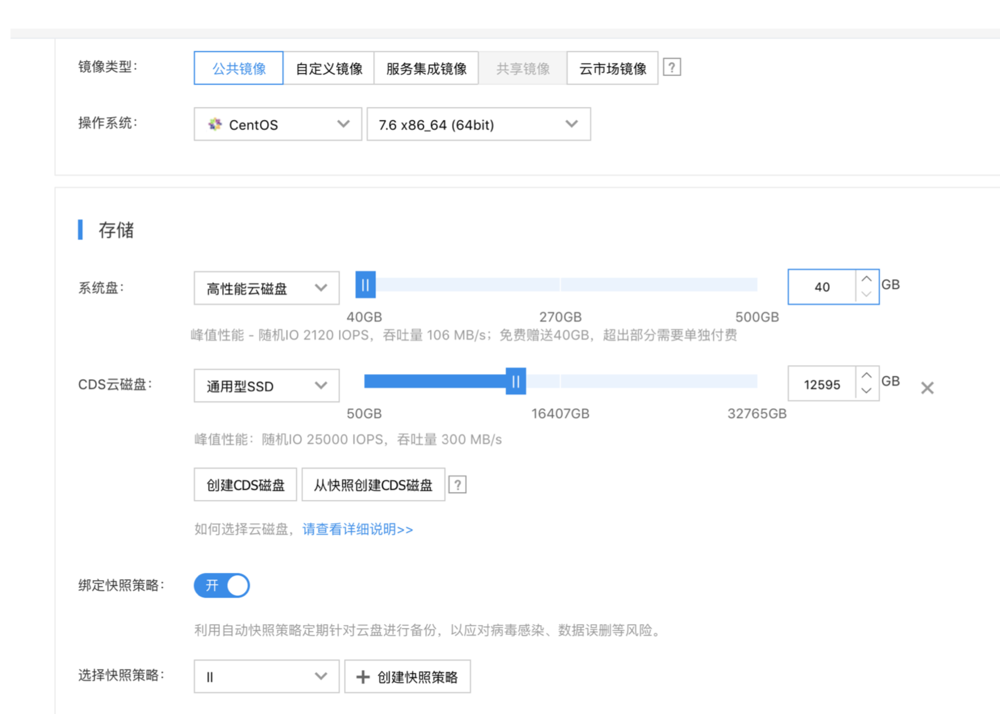

# 如何搭建HDFS集群

## 综述

本篇文章只是用于demo的HDFS集群搭建教程，用于跑通ElasticCTR的各个流程。本文将会带着大家在百度云的节点上搭建一个HDFS，并将Criteo数据集按照ElasticCTR的数据集格式要求，存放在HDFS上。

## 购买BCC

搭建 HDFS 集群的过程较为复杂，首先需要购买一个 BCC 实例

<p align="center">
    <br>

    <br>
<p>

在 BCC 实例当中购买较大的 CDS 云磁盘。  

## 安装并启动Hadoop

在进入 BCC 之后首先需要用 fdisk 工具确认分区是否已经安装。

选择 hadoop-2.8.5.tar.gz。下载后解压把 hadoop-2.8.5 目录 move 到/usr/local 目录下。 在/usr/local/hadoop-2.8.5/etc/hadoop/下，编辑 core-site.xml文件，修改为
```
<configuration>
<property>
  <name>fs.defaultFS</name>
  <value>hdfs://${LOCAL_IP}:9000</value>
</property>
<property>
  <name>hadoop.tmp.dir</name>
  <value>/data/hadoop</value>
</property>
</configuration>
```


此处 `$LOCAL_IP` 推荐用内网的 IP，也就是在 ifconfig 下为 `192.168` 开头的 IP，在 K8S 当中也可以被访问 到。

在 `slave` 文件下输入 `root@127.0.0.1`

接下来配置无密码访问，首先要 `ssh-keygen`，无论提示什么全部回车数次之后，用 `ssh-copy-id` 命令把无密码访问配置到 `127.0.0.1` ,`localhost` ,`0.0.0.0` 几个 IP 地址。

把`/usr/local/hadoop-2.8.5/etc/hadoop` 设置为 `$HADOOP_HOME`

再把`$HADOOP_HOME/bin` 放在 `$PATH` 下。如果输入 `hadoop` 命令可以被执行，就执行 `hadoop namenode format`。

最后在`/usr/local/hadoop-2.8.5/sbin` 目录下运行 ，`start-all.sh`。


以上操作之后，HDFS 服务就启动完毕，接下来就创建流式训练的文件夹 `/train_data/`，使用命令 `hdfs dfs -mkdir hdfs://$IP:9000/train_data/`

## 复制Criteo数据集到HDFS
接下来从 `https://paddle-elasticctr.bj.bcebos.com/criteo_dataset/criteo_demo.tar.gz` 下载数据集，解压之后在criteo_demo下
执行
`hdfs dfs -put * hdfs://$IP:9000/train_data/20200401`
`$IP`就是先前到HDFS地址。
这样，就在train_data下目录到20200401目录下存放了5个小时的训练集。20200401可以改动成任意一个日期。
在主页面的教程中，`data.config`文件就是用来现在配置的HDFS信息，日期信息会在这里被调用。
